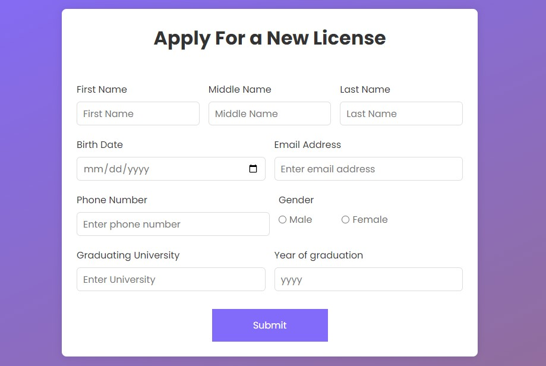
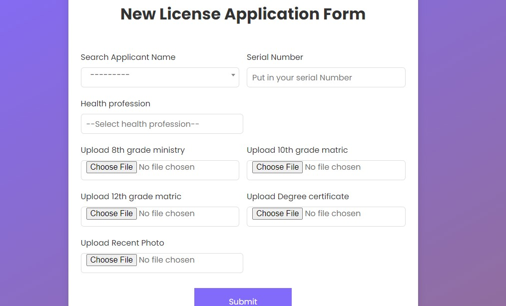
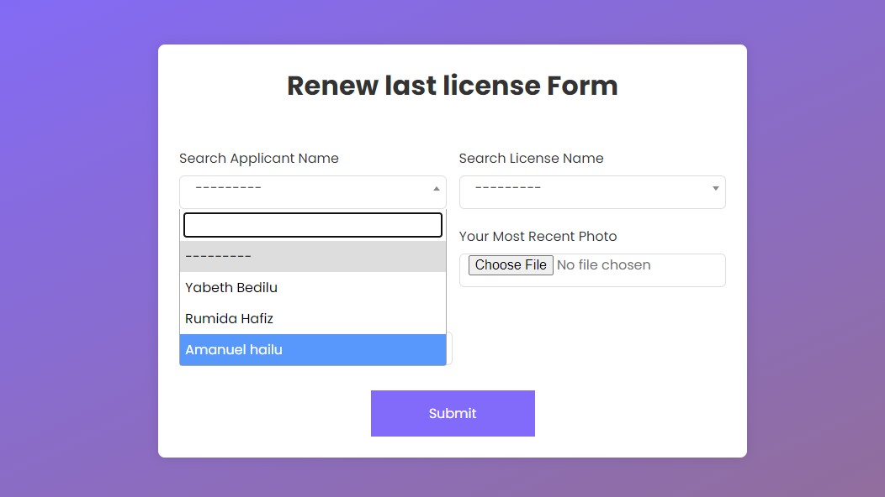
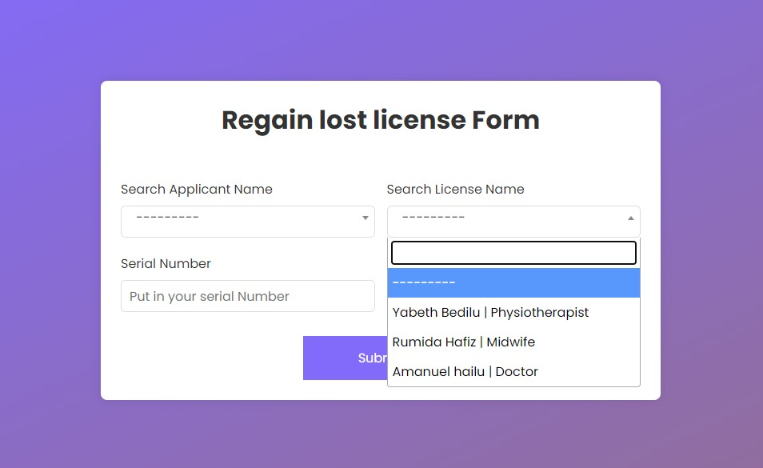
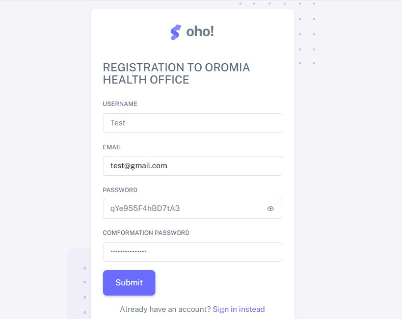
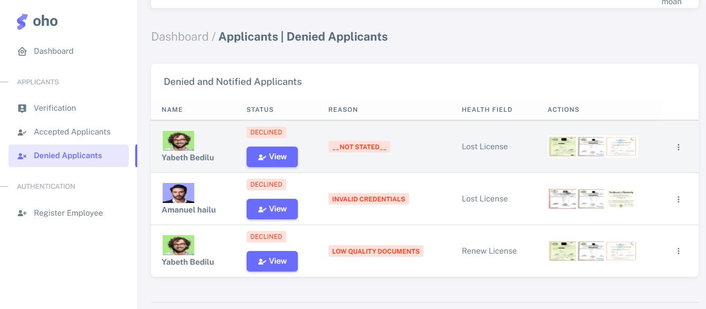

# Medical Licence Application & Renewal

# Installiation
* Change directory to `Backen/MLAR` in terminal
> ## Envirenoment Setup
 - `python -m venv MLAR_env` Setup environment
 - `.\MLAR_env\scripts\activate` Run Virtual enviroment
 
> ## PIP-Installiation
 -  `pip install -r requirements.txt` Install all pip dependencies 
 
 > ## Make SuperUser
  - `python manage.py createsuperuser` Create Super User
  
 # Running
 > ## Run Server 
  - `python manage.py runserver 7000` run server (on port 7000)
 
  # Tests
 > ## Testing
  - `python manage.py test` Tests

# All Pages

> # Applicants End
### A. Home

### B. Applicants Registration

### C. New License

### D. Renew License

### E. Register Lost Licence

> # Dashboard
### A. Verifi(Home)

### B. Verification

### C. Login

### D. Denied License

